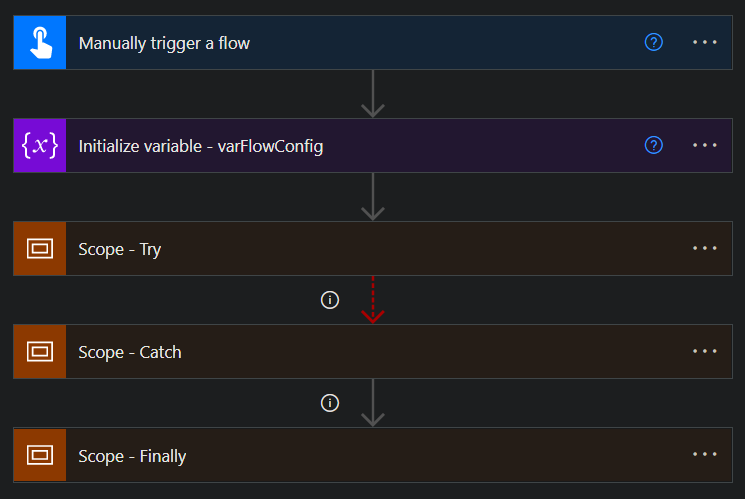
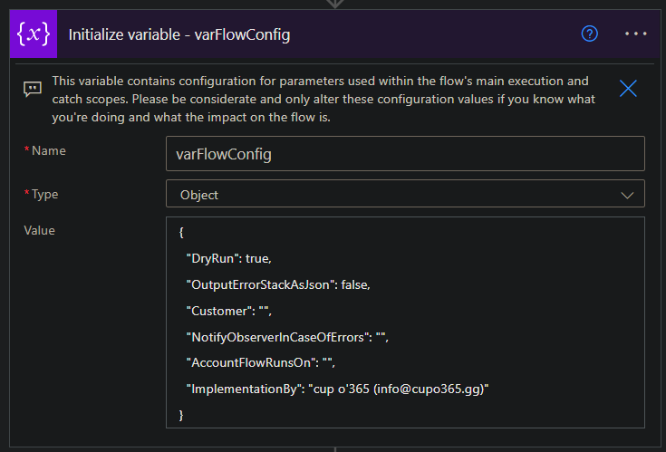
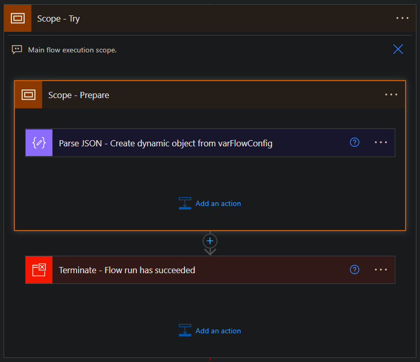
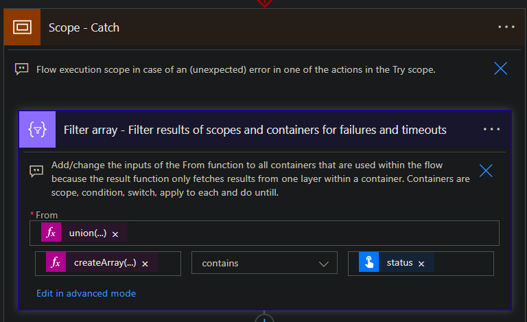

# Default flow template with error handling

## Table of Contents
  - [Summary](#summary)
  - [Applies to](#applies-to)
  - [Solution](#solution)
  - [Version history](#version-history)
  - [Minimal path to awesome](#minimal-path-to-awesome)
  - [Download the flow ZIP package](#download-the-flow-ZIP-package)

## Summary

This flow template can be used as a default template for every flow you make. It contains a try-catch-finally mechanism by using scopes and has functionality to create an error stack and process this stack as a JSON object or HTML text which you then can use to notify observers via actions like Send an email (v2). Moreover, the flow contains a flow config variable in which you can configure specific context variables like a dry run or whom the observer is in cases of errors. Want to see how you can implement this flow? See [minimal path to awesome](#minimal-path-to-awesome).

**[ __Download the flow ZIP package here!__](https://github.com/cupo365/default-flow-with-error-handling/releases/tag/v1.0.0)**

## Applies to


## Solution

| Solution                          | Author(s)                                        |
| --------------------------------- | ------------------------------------------------ |
| Flow template with error handling | cup o'365 ([contact me](mailto:info@cupo365.gg)) |

## Version history

| Version | Date         | Comments        |
| ------- | ------------ | --------------- |
| 1.0     | July 2, 2022 | Initial release |

## Minimal path to awesome

1. [Download the flow ZIP package](#download-the-flow-zip-package), browse to Power Automate, sign in and import the ZIP package as cloud flow
   
2. Change the trigger. To avoid this flow having connections you would have to create, the trigger is set to manual.
3. Configure the varFlowConfig variable
   
4. Start building your flow inside the try-scope
   
5. Append every container action inside your flow to the filter in the catch-scope (see screenshot below). Container actions can disguise errors within them. Therefore, each container action should be added to the 'From' formula in the filter results action in the catch-scope. By default, all existing container actions are already added to the default formula. The formula is ```union(coalesce(result('Scope_-_Try'), createArray(null)), coalesce(result('Scope_-_Prepare'), createArray(null)))```. To add an action to this formula, simply add ```coalesce(result('{NAME_OF_CONTAINER_ACTION}'), createArray(null))```. Container actions are: scopes, conditions, switches, apply to eaches and do untils.
   
6. To allow the flow to notify an observer in case of an erorr: add an email action in the catch-scope if needed. To avoid the flow having connections, an email action (or any other notification for that matter) is not included, but you can add it yourself to the last condition of the catch-scope. This condition already contains a compose action with proposed input.
7. Enjoy :)
## Download the flow ZIP package

**[ __Download the flow ZIP package here!__](https://github.com/cupo365/default-flow-with-error-handling/releases/tag/v1.0.0)**
